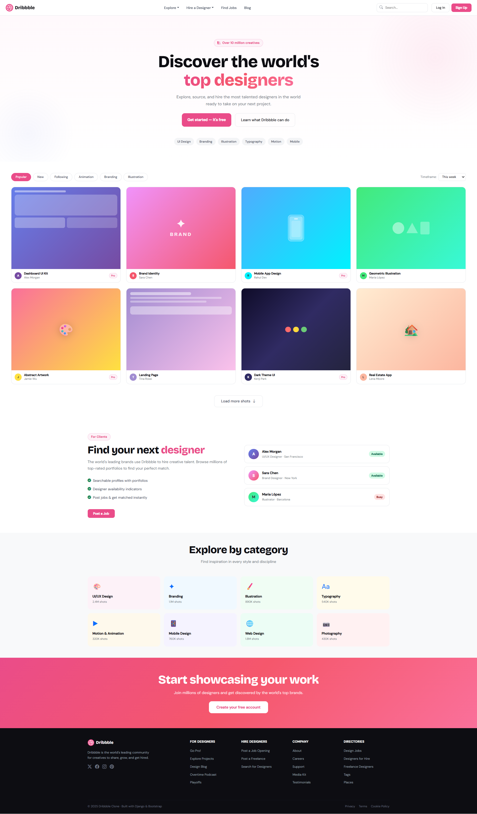

# Project Responsive Web Design using Bootstrap
## Date:29-05-2026

## AIM:
To create a simplified clone of Dribbble (https://dribbble.com/) landing page.


## DESIGN STEPS:

### Step 1:
Clone the repository from GitHub.

### Step 2:
Create Django Admin project.

### Step 3:
Create a New App under the Django Admin project.

### Step 4:
Insert the necessary CSS and JavaScript files as external in order to use Bootstrap.

### Step 5:
Create a HTML file and include the needed Bootstrap components.

### Step 6:
Publish the website in the LocalHost.

## PROGRAM :
## index.html
```html

<!DOCTYPE html>
<html lang="en">
<head>
  <meta charset="UTF-8" />
  <meta name="viewport" content="width=device-width, initial-scale=1.0"/>
  <title>Dribbble – Discover the World's Top Designers</title>


  <link href="https://cdn.jsdelivr.net/npm/bootstrap@5.3.3/dist/css/bootstrap.min.css" rel="stylesheet"/>

  <link href="https://cdn.jsdelivr.net/npm/bootstrap-icons@1.11.3/font/bootstrap-icons.min.css" rel="stylesheet"/>

  <link href="https://fonts.googleapis.com/css2?family=Bricolage+Grotesque:wght@400;600;700;800&family=DM+Sans:ital,wght@0,300;0,400;0,500;1,300&display=swap" rel="stylesheet"/>

  <link rel="stylesheet" href=""/>
</head>
<body>

<nav class="navbar navbar-expand-lg drib-navbar sticky-top">
  <div class="container-fluid px-4">

    <a class="navbar-brand drib-logo" href="#">
      <svg width="32" height="32" viewBox="0 0 32 32" fill="none">
        <circle cx="16" cy="16" r="16" fill="#EA4C89"/>
        <path d="M16 4C9.373 4 4 9.373 4 16s5.373 12 12 12 12-5.373 12-12S22.627 4 16 4zm7.8 5.54a10.17 10.17 0 012.38 6.62c-.34-.07-3.78-.77-7.24-.33-.08-.18-.15-.37-.23-.56-.22-.53-.46-1.06-.71-1.58 3.83-1.56 5.57-3.8 5.8-4.15zM16 5.82c2.64 0 5.05.97 6.88 2.56-.2.32-1.78 2.4-5.47 3.78-1.71-3.14-3.61-5.72-3.9-6.1A10.22 10.22 0 0116 5.82zM11.7 6.7c.28.36 2.15 2.96 3.88 6.04-4.9 1.3-9.22 1.28-9.7 1.27A10.21 10.21 0 0111.7 6.7zM5.8 16.01v-.27c.47.01 5.55.1 10.77-1.49.3.59.59 1.18.86 1.79-.14.04-.27.08-.41.13-5.4 1.74-8.27 6.5-8.51 6.92A10.18 10.18 0 015.8 16zM16 26.2a10.17 10.17 0 01-6.28-2.16c.2-.4 2.51-4.87 8.49-6.96l.07-.02a36.7 36.7 0 011.85 6.55A10.16 10.16 0 0116 26.2zm5.84-1.75a38.44 38.44 0 00-1.72-6.14c3.25-.52 6.1.33 6.45.44a10.22 10.22 0 01-4.73 5.7z" fill="white"/>
      </svg>
      <span class="ms-2">Dribbble</span>
    </a>

    <button class="navbar-toggler border-0" type="button" data-bs-toggle="collapse" data-bs-target="#mainNav">
      <span class="navbar-toggler-icon"></span>
    </button>

    <div class="collapse navbar-collapse" id="mainNav">

      <ul class="navbar-nav mx-auto gap-1">
        <li class="nav-item dropdown">
          <a class="nav-link drib-nav-link dropdown-toggle" href="#" data-bs-toggle="dropdown">Explore</a>
          <ul class="dropdown-menu drib-dropdown">
            <li><a class="dropdown-item" href="#"><i class="bi bi-fire me-2 text-danger"></i>Popular</a></li>
            <li><a class="dropdown-item" href="#"><i class="bi bi-clock me-2 text-primary"></i>New &amp; Noteworthy</a></li>
            <li><a class="dropdown-item" href="#"><i class="bi bi-stars me-2 text-warning"></i>Following</a></li>
          </ul>
        </li>
        <li class="nav-item dropdown">
          <a class="nav-link drib-nav-link dropdown-toggle" href="#" data-bs-toggle="dropdown">Hire a Designer</a>
          <ul class="dropdown-menu drib-dropdown">
            <li><a class="dropdown-item" href="#">Post a Job</a></li>
            <li><a class="dropdown-item" href="#">Designer Search</a></li>
            <li><a class="dropdown-item" href="#">Freelance</a></li>
          </ul>
        </li>
        <li class="nav-item"><a class="nav-link drib-nav-link" href="#">Find Jobs</a></li>
        <li class="nav-item"><a class="nav-link drib-nav-link" href="#">Blog</a></li>
      </ul>

      <div class="drib-search-wrap me-3 d-none d-lg-flex">
        <i class="bi bi-search drib-search-icon"></i>
        <input type="text" class="drib-search" placeholder="Search…"/>
      </div>

      <div class="d-flex gap-2 align-items-center">
        <a href="#" class="btn drib-btn-ghost">Log In</a>
        <a href="#" class="btn drib-btn-primary">Sign Up</a>
      </div>
    </div>
  </div>
</nav>

<section class="drib-hero">
  <div class="container text-center">
    <div class="drib-hero-badge mb-4">
      <span><i class="bi bi-palette2 me-1"></i> Over 10 million creatives</span>
    </div>
    <h1 class="drib-hero-title">
      Discover the world's<br/>
      <span class="drib-gradient-text">top designers</span>
    </h1>
    <p class="drib-hero-sub">
      Explore, source, and hire the most talented designers in the world<br class="d-none d-md-block"/>
      ready to take on your next project.
    </p>
    <div class="d-flex justify-content-center gap-3 flex-wrap mt-4">
      <a href="#" class="btn drib-btn-hero-primary px-4 py-3">Get started — it's free</a>
      <a href="#" class="btn drib-btn-hero-ghost px-4 py-3">Learn what Dribbble can do</a>
    </div>

    <div class="drib-tags mt-5">
      <span class="drib-tag">UI Design</span>
      <span class="drib-tag">Branding</span>
      <span class="drib-tag">Illustration</span>
      <span class="drib-tag">Typography</span>
      <span class="drib-tag">Motion</span>
      <span class="drib-tag">Mobile</span>
    </div>
  </div>
</section>

<section class="drib-shots py-5">
  <div class="container-fluid px-4 px-md-5">

    <div class="drib-filter-bar mb-4 d-flex align-items-center justify-content-between flex-wrap gap-3">
      <div class="d-flex gap-2 flex-wrap">
        <button class="drib-filter-btn active">Popular</button>
        <button class="drib-filter-btn">New</button>
        <button class="drib-filter-btn">Following</button>
        <button class="drib-filter-btn">Animation</button>
        <button class="drib-filter-btn">Branding</button>
        <button class="drib-filter-btn">Illustration</button>
      </div>
      <div class="d-flex align-items-center gap-2">
        <span class="drib-filter-label">Timeframe:</span>
        <select class="drib-select">
          <option>This week</option>
          <option>This month</option>
          <option>All time</option>
        </select>
      </div>
    </div>
    <div class="row g-4">

      <div class="col-6 col-md-4 col-xl-3">
        <div class="drib-card">
          <div class="drib-card-thumb" style="background: linear-gradient(135deg, #667eea 0%, #764ba2 100%);">
            <div class="drib-card-overlay">
              <div class="drib-card-actions">
                <button class="drib-action-btn"><i class="bi bi-heart"></i> 1.2k</button>
                <button class="drib-action-btn"><i class="bi bi-eye"></i> 8.4k</button>
              </div>
            </div>
            <div class="drib-mock-ui">
              <div class="drib-mock-bar"></div>
              <div class="drib-mock-block tall" style="background:rgba(255,255,255,0.25);border-radius:12px;"></div>
              <div class="drib-mock-row">
                <div class="drib-mock-block" style="background:rgba(255,255,255,0.3);border-radius:8px;"></div>
                <div class="drib-mock-block" style="background:rgba(255,255,255,0.2);border-radius:8px;"></div>
              </div>
            </div>
          </div>
          <div class="drib-card-meta">
            <div class="drib-card-avatar" style="background:#764ba2;">A</div>
            <div>
              <div class="drib-card-name">Dashboard UI Kit</div>
              <div class="drib-card-author">Alex Morgan</div>
            </div>
            <span class="drib-card-badge ms-auto">Pro</span>
          </div>
        </div>
      </div>

      <div class="col-6 col-md-4 col-xl-3">
        <div class="drib-card">
          <div class="drib-card-thumb" style="background: linear-gradient(135deg, #f093fb 0%, #f5576c 100%);">
            <div class="drib-card-overlay">
              <div class="drib-card-actions">
                <button class="drib-action-btn"><i class="bi bi-heart"></i> 2.5k</button>
                <button class="drib-action-btn"><i class="bi bi-eye"></i> 14k</button>
              </div>
            </div>
            <div class="drib-mock-ui drib-mock-brand">
              <div class="drib-brand-logo">✦</div>
              <div class="drib-brand-text">BRAND</div>
            </div>
          </div>
          <div class="drib-card-meta">
            <div class="drib-card-avatar" style="background:#f5576c;">S</div>
            <div>
              <div class="drib-card-name">Brand Identity</div>
              <div class="drib-card-author">Sara Chen</div>
            </div>
          </div>
        </div>
      </div>

      <div class="col-6 col-md-4 col-xl-3">
        <div class="drib-card">
          <div class="drib-card-thumb" style="background: linear-gradient(135deg, #4facfe 0%, #00f2fe 100%);">
            <div class="drib-card-overlay">
              <div class="drib-card-actions">
                <button class="drib-action-btn"><i class="bi bi-heart"></i> 987</button>
                <button class="drib-action-btn"><i class="bi bi-eye"></i> 6.1k</button>
              </div>
            </div>
            <div class="drib-mock-ui drib-mock-mobile">
              <div class="drib-phone">
                <div class="drib-phone-screen">
                  <div class="drib-phone-bar"></div>
                  <div class="drib-phone-content"></div>
                </div>
              </div>
            </div>
          </div>
          <div class="drib-card-meta">
            <div class="drib-card-avatar" style="background:#00f2fe;color:#333;">R</div>
            <div>
              <div class="drib-card-name">Mobile App Design</div>
              <div class="drib-card-author">Rahul Dev</div>
            </div>
            <span class="drib-card-badge ms-auto">Pro</span>
          </div>
        </div>
      </div>

      <div class="col-6 col-md-4 col-xl-3">
        <div class="drib-card">
          <div class="drib-card-thumb" style="background: linear-gradient(135deg, #43e97b 0%, #38f9d7 100%);">
            <div class="drib-card-overlay">
              <div class="drib-card-actions">
                <button class="drib-action-btn"><i class="bi bi-heart"></i> 3.3k</button>
                <button class="drib-action-btn"><i class="bi bi-eye"></i> 20k</button>
              </div>
            </div>
            <div class="drib-mock-ui drib-mock-illus">
              <div class="drib-illus-shape circle"></div>
              <div class="drib-illus-shape triangle"></div>
              <div class="drib-illus-shape rect"></div>
            </div>
          </div>
          <div class="drib-card-meta">
            <div class="drib-card-avatar" style="background:#43e97b;color:#333;">M</div>
            <div>
              <div class="drib-card-name">Geometric Illustration</div>
              <div class="drib-card-author">Maria López</div>
            </div>
          </div>
        </div>
      </div>

      <div class="col-6 col-md-4 col-xl-3">
        <div class="drib-card">
          <div class="drib-card-thumb" style="background: linear-gradient(135deg, #fa709a 0%, #fee140 100%);">
            <div class="drib-card-overlay">
              <div class="drib-card-actions">
                <button class="drib-action-btn"><i class="bi bi-heart"></i> 4.1k</button>
                <button class="drib-action-btn"><i class="bi bi-eye"></i> 28k</button>
              </div>
            </div>
            <div class="drib-mock-ui" style="display:flex;align-items:center;justify-content:center;">
              <div style="font-size:3.5rem;filter:drop-shadow(0 4px 16px rgba(0,0,0,0.2));">🎨</div>
            </div>
          </div>
          <div class="drib-card-meta">
            <div class="drib-card-avatar" style="background:#fee140;color:#333;">J</div>
            <div>
              <div class="drib-card-name">Abstract Artwork</div>
              <div class="drib-card-author">Jamie Wu</div>
            </div>
            <span class="drib-card-badge ms-auto">Pro</span>
          </div>
        </div>
      </div>

      <div class="col-6 col-md-4 col-xl-3">
        <div class="drib-card">
          <div class="drib-card-thumb" style="background: linear-gradient(135deg, #a18cd1 0%, #fbc2eb 100%);">
            <div class="drib-card-overlay">
              <div class="drib-card-actions">
                <button class="drib-action-btn"><i class="bi bi-heart"></i> 1.8k</button>
                <button class="drib-action-btn"><i class="bi bi-eye"></i> 11k</button>
              </div>
            </div>
            <div class="drib-mock-ui" style="display:flex;flex-direction:column;gap:8px;padding:16px;">
              <div style="height:12px;background:rgba(255,255,255,0.5);border-radius:6px;width:60%;"></div>
              <div style="height:8px;background:rgba(255,255,255,0.35);border-radius:6px;width:90%;"></div>
              <div style="height:8px;background:rgba(255,255,255,0.35);border-radius:6px;width:75%;"></div>
              <div style="height:36px;background:rgba(255,255,255,0.4);border-radius:10px;margin-top:8px;"></div>
            </div>
          </div>
          <div class="drib-card-meta">
            <div class="drib-card-avatar" style="background:#a18cd1;">T</div>
            <div>
              <div class="drib-card-name">Landing Page</div>
              <div class="drib-card-author">Tina Rossi</div>
            </div>
          </div>
        </div>
      </div>

      <div class="col-6 col-md-4 col-xl-3">
        <div class="drib-card">
          <div class="drib-card-thumb" style="background:linear-gradient(135deg,#0f0c29,#302b63,#24243e);">
            <div class="drib-card-overlay">
              <div class="drib-card-actions">
                <button class="drib-action-btn"><i class="bi bi-heart"></i> 5.6k</button>
                <button class="drib-action-btn"><i class="bi bi-eye"></i> 33k</button>
              </div>
            </div>
            <div class="drib-mock-ui" style="display:flex;align-items:center;justify-content:center;">
              <div class="drib-dark-widget">
                <div class="drib-dw-dot" style="background:#FF6B6B;"></div>
                <div class="drib-dw-dot" style="background:#FFD93D;"></div>
                <div class="drib-dw-dot" style="background:#6BCB77;"></div>
              </div>
            </div>
          </div>
          <div class="drib-card-meta">
            <div class="drib-card-avatar" style="background:#302b63;">K</div>
            <div>
              <div class="drib-card-name">Dark Theme UI</div>
              <div class="drib-card-author">Kenji Park</div>
            </div>
            <span class="drib-card-badge ms-auto">Pro</span>
          </div>
        </div>
      </div>

      <div class="col-6 col-md-4 col-xl-3">
        <div class="drib-card">
          <div class="drib-card-thumb" style="background:linear-gradient(135deg,#ffecd2,#fcb69f);">
            <div class="drib-card-overlay">
              <div class="drib-card-actions">
                <button class="drib-action-btn"><i class="bi bi-heart"></i> 2.9k</button>
                <button class="drib-action-btn"><i class="bi bi-eye"></i> 17k</button>
              </div>
            </div>
            <div class="drib-mock-ui" style="display:flex;align-items:center;justify-content:center;">
              <div style="font-size:3.5rem;filter:drop-shadow(0 4px 16px rgba(0,0,0,0.15));">🏡</div>
            </div>
          </div>
          <div class="drib-card-meta">
            <div class="drib-card-avatar" style="background:#fcb69f;color:#333;">L</div>
            <div>
              <div class="drib-card-name">Real Estate App</div>
              <div class="drib-card-author">Lena Moore</div>
            </div>
          </div>
        </div>
      </div>

    </div>

  
    <div class="text-center mt-5">
      <a href="#" class="btn drib-btn-load">Load more shots <i class="bi bi-arrow-down ms-1"></i></a>
    </div>

  </div>
</section>

<section class="drib-hire py-5">
  <div class="container py-3">
    <div class="row align-items-center g-5">
      <div class="col-lg-6">
        <div class="drib-hire-badge mb-3">For Clients</div>
        <h2 class="drib-section-title">Find your next <span class="drib-pink">designer</span></h2>
        <p class="drib-section-sub">The world's leading brands use Dribbble to hire creative talent. Browse millions of top-rated portfolios to find your perfect match.</p>
        <ul class="drib-hire-list">
          <li><i class="bi bi-check-circle-fill text-success me-2"></i>Searchable profiles with portfolios</li>
          <li><i class="bi bi-check-circle-fill text-success me-2"></i>Designer availability indicators</li>
          <li><i class="bi bi-check-circle-fill text-success me-2"></i>Post jobs &amp; get matched instantly</li>
        </ul>
        <a href="#" class="btn drib-btn-primary mt-3 px-4">Post a Job</a>
      </div>
      <div class="col-lg-6">
        <div class="drib-hire-cards">
          <div class="drib-profile-card">
            <div class="drib-pc-avatar" style="background:linear-gradient(135deg,#667eea,#764ba2);">A</div>
            <div class="drib-pc-info">
              <div class="drib-pc-name">Alex Morgan</div>
              <div class="drib-pc-role">UI/UX Designer · San Francisco</div>
            </div>
            <span class="drib-available-badge">Available</span>
          </div>
          <div class="drib-profile-card">
            <div class="drib-pc-avatar" style="background:linear-gradient(135deg,#f093fb,#f5576c);">S</div>
            <div class="drib-pc-info">
              <div class="drib-pc-name">Sara Chen</div>
              <div class="drib-pc-role">Brand Designer · New York</div>
            </div>
            <span class="drib-available-badge">Available</span>
          </div>
          <div class="drib-profile-card">
            <div class="drib-pc-avatar" style="background:linear-gradient(135deg,#43e97b,#38f9d7);color:#333;">M</div>
            <div class="drib-pc-info">
              <div class="drib-pc-name">Maria López</div>
              <div class="drib-pc-role">Illustrator · Barcelona</div>
            </div>
            <span class="drib-busy-badge">Busy</span>
          </div>
        </div>
      </div>
    </div>
  </div>
</section>

<section class="drib-categories py-5 bg-light">
  <div class="container">
    <h2 class="drib-section-title text-center mb-2">Explore by category</h2>
    <p class="drib-section-sub text-center mb-5">Find inspiration in every style and discipline</p>
    <div class="row g-3">
      
      <div class="col-6 col-md-4 col-lg-3">
        <a href="#" class="drib-cat-card" style="background:{{ cat.bg }};">
          <span class="drib-cat-icon">{{ cat.icon }}</span>
          <span class="drib-cat-label">{{ cat.name }}</span>
          <span class="drib-cat-count">{{ cat.count }} shots</span>
        </a>
      </div>
      
    </div>
  </div>
</section>

<section class="drib-cta-banner py-5">
  <div class="container text-center py-3">
    <h2 class="drib-cta-title">Start showcasing your work</h2>
    <p class="drib-cta-sub">Join millions of designers and get discovered by the world's top brands.</p>
    <a href="#" class="btn drib-btn-cta mt-2">Create your free account</a>
  </div>
</section>
<footer class="drib-footer pt-5 pb-4">
  <div class="container">
    <div class="row g-4">
      <!-- Brand -->
      <div class="col-lg-4 col-md-6">
        <div class="drib-footer-brand mb-3">
          <svg width="28" height="28" viewBox="0 0 32 32" fill="none">
            <circle cx="16" cy="16" r="16" fill="#EA4C89"/>
            <path d="M16 4C9.373 4 4 9.373 4 16s5.373 12 12 12 12-5.373 12-12S22.627 4 16 4zm7.8 5.54a10.17 10.17 0 012.38 6.62c-.34-.07-3.78-.77-7.24-.33-.08-.18-.15-.37-.23-.56-.22-.53-.46-1.06-.71-1.58 3.83-1.56 5.57-3.8 5.8-4.15zM16 5.82c2.64 0 5.05.97 6.88 2.56-.2.32-1.78 2.4-5.47 3.78-1.71-3.14-3.61-5.72-3.9-6.1A10.22 10.22 0 0116 5.82zM11.7 6.7c.28.36 2.15 2.96 3.88 6.04-4.9 1.3-9.22 1.28-9.7 1.27A10.21 10.21 0 0111.7 6.7zM5.8 16.01v-.27c.47.01 5.55.1 10.77-1.49.3.59.59 1.18.86 1.79-.14.04-.27.08-.41.13-5.4 1.74-8.27 6.5-8.51 6.92A10.18 10.18 0 015.8 16zM16 26.2a10.17 10.17 0 01-6.28-2.16c.2-.4 2.51-4.87 8.49-6.96l.07-.02a36.7 36.7 0 011.85 6.55A10.16 10.16 0 0116 26.2zm5.84-1.75a38.44 38.44 0 00-1.72-6.14c3.25-.52 6.1.33 6.45.44a10.22 10.22 0 01-4.73 5.7z" fill="white"/>
          </svg>
          <span class="ms-2 drib-footer-logo-text">Dribbble</span>
        </div>
        <p class="drib-footer-tagline">Dribbble is the world's leading community for creatives to share, grow, and get hired.</p>
        <div class="drib-social-links mt-3">
          <a href="#"><i class="bi bi-twitter-x"></i></a>
          <a href="#"><i class="bi bi-facebook"></i></a>
          <a href="#"><i class="bi bi-instagram"></i></a>
          <a href="#"><i class="bi bi-pinterest"></i></a>
        </div>
      </div>
      <div class="col-lg-2 col-md-3 col-6">
        <div class="drib-footer-heading">For Designers</div>
        <ul class="drib-footer-links">
          <li><a href="#">Go Pro!</a></li>
          <li><a href="#">Explore Projects</a></li>
          <li><a href="#">Design Blog</a></li>
          <li><a href="#">Overtime Podcast</a></li>
          <li><a href="#">Playoffs</a></li>
        </ul>
      </div>

      <div class="col-lg-2 col-md-3 col-6">
        <div class="drib-footer-heading">Hire Designers</div>
        <ul class="drib-footer-links">
          <li><a href="#">Post a Job Opening</a></li>
          <li><a href="#">Post a Freelance</a></li>
          <li><a href="#">Search for Designers</a></li>
        </ul>
      </div>

      <div class="col-lg-2 col-md-3 col-6">
        <div class="drib-footer-heading">Company</div>
        <ul class="drib-footer-links">
          <li><a href="#">About</a></li>
          <li><a href="#">Careers</a></li>
          <li><a href="#">Support</a></li>
          <li><a href="#">Media Kit</a></li>
          <li><a href="#">Testimonials</a></li>
        </ul>
      </div>

      <div class="col-lg-2 col-md-3 col-6">
        <div class="drib-footer-heading">Directories</div>
        <ul class="drib-footer-links">
          <li><a href="#">Design Jobs</a></li>
          <li><a href="#">Designers for Hire</a></li>
          <li><a href="#">Freelance Designers</a></li>
          <li><a href="#">Tags</a></li>
          <li><a href="#">Places</a></li>
        </ul>
      </div>
    </div>

    <hr class="drib-footer-hr mt-5"/>
    <div class="d-flex flex-wrap justify-content-between align-items-center gap-2">
      <div class="drib-footer-copy">© 2025 Dribbble Clone · Built with Django &amp; Bootstrap</div>
      <div class="d-flex gap-3">
        <a href="#" class="drib-footer-legal">Privacy</a>
        <a href="#" class="drib-footer-legal">Terms</a>
        <a href="#" class="drib-footer-legal">Cookie Policy</a>
      </div>
    </div>
  </div>
</footer>

<script src="https://cdn.jsdelivr.net/npm/bootstrap@5.3.3/dist/js/bootstrap.bundle.min.js"></script>
<script src=""></script>

</body>
</html>
```
## style.css
```css
:root {
  --drib-pink:     #EA4C89;
  --drib-pink-dk:  #c73874;
  --drib-dark:     #0d0d12;
  --drib-gray:     #6b7280;
  --drib-light:    #f9fafb;
  --drib-border:   #e5e7eb;
  --drib-white:    #ffffff;
  --drib-card-r:   16px;
  --drib-trans:    all .25s cubic-bezier(.4,0,.2,1);
}

*, *::before, *::after { box-sizing: border-box; margin: 0; padding: 0; }

body {
  font-family: 'DM Sans', sans-serif;
  background: var(--drib-white);
  color: var(--drib-dark);
  -webkit-font-smoothing: antialiased;
}

.drib-navbar {
  background: rgba(255,255,255,0.92);
  backdrop-filter: blur(14px);
  border-bottom: 1px solid var(--drib-border);
  padding: 12px 0;
  z-index: 1000;
}

.drib-logo {
  font-family: 'Bricolage Grotesque', sans-serif;
  font-weight: 800;
  font-size: 1.25rem;
  color: var(--drib-dark) !important;
  text-decoration: none;
  display: flex;
  align-items: center;
}

.drib-nav-link {
  font-size: 0.92rem;
  font-weight: 500;
  color: #374151 !important;
  padding: 8px 14px !important;
  border-radius: 8px;
  transition: var(--drib-trans);
}
.drib-nav-link:hover {
  color: var(--drib-pink) !important;
  background: #fdf2f8;
}

.drib-dropdown {
  border: 1px solid var(--drib-border);
  border-radius: 12px;
  box-shadow: 0 8px 32px rgba(0,0,0,0.10);
  padding: 8px;
  min-width: 200px;
}
.drib-dropdown .dropdown-item {
  border-radius: 8px;
  font-size: 0.9rem;
  padding: 9px 14px;
  transition: var(--drib-trans);
}
.drib-dropdown .dropdown-item:hover {
  background: #fdf2f8;
  color: var(--drib-pink);
}

.drib-search-wrap {
  position: relative;
  align-items: center;
}
.drib-search-icon {
  position: absolute;
  left: 12px;
  color: var(--drib-gray);
  font-size: .9rem;
  pointer-events: none;
}
.drib-search {
  border: 1.5px solid var(--drib-border);
  border-radius: 10px;
  padding: 8px 14px 8px 36px;
  font-size: .88rem;
  width: 220px;
  transition: var(--drib-trans);
  outline: none;
  color: var(--drib-dark);
}
.drib-search:focus {
  border-color: var(--drib-pink);
  box-shadow: 0 0 0 3px rgba(234,76,137,.12);
  width: 260px;
}

.drib-btn-ghost {
  font-size: .88rem;
  font-weight: 500;
  padding: 8px 18px;
  border-radius: 9px;
  border: 1.5px solid var(--drib-border);
  color: var(--drib-dark);
  transition: var(--drib-trans);
  background: transparent;
}
.drib-btn-ghost:hover {
  border-color: var(--drib-pink);
  color: var(--drib-pink);
}
.drib-btn-primary {
  font-size: .88rem;
  font-weight: 600;
  padding: 8px 18px;
  border-radius: 9px;
  background: var(--drib-pink);
  color: #fff !important;
  border: none;
  transition: var(--drib-trans);
}
.drib-btn-primary:hover {
  background: var(--drib-pink-dk);
  transform: translateY(-1px);
  box-shadow: 0 4px 16px rgba(234,76,137,.3);
}

.drib-hero {
  padding: 100px 20px 70px;
  background: linear-gradient(180deg, #fff9fc 0%, #ffffff 100%);
  position: relative;
  overflow: hidden;
}
.drib-hero::before {
  content: '';
  position: absolute;
  top: -120px; right: -120px;
  width: 600px; height: 600px;
  background: radial-gradient(circle, rgba(234,76,137,.08) 0%, transparent 70%);
  pointer-events: none;
}
.drib-hero::after {
  content: '';
  position: absolute;
  bottom: -80px; left: -80px;
  width: 400px; height: 400px;
  background: radial-gradient(circle, rgba(102,126,234,.06) 0%, transparent 70%);
  pointer-events: none;
}

.drib-hero-badge {
  display: inline-flex;
  align-items: center;
  background: #fdf2f8;
  border: 1px solid #f5c6de;
  color: var(--drib-pink);
  font-size: .82rem;
  font-weight: 600;
  padding: 6px 14px;
  border-radius: 100px;
  letter-spacing: .4px;
}

.drib-hero-title {
  font-family: 'Bricolage Grotesque', sans-serif;
  font-size: clamp(2.4rem, 6vw, 4.5rem);
  font-weight: 800;
  line-height: 1.1;
  letter-spacing: -1.5px;
  color: var(--drib-dark);
}

.drib-gradient-text {
  background: linear-gradient(135deg, var(--drib-pink) 0%, #f5576c 50%, #fa709a 100%);
  -webkit-background-clip: text;
  -webkit-text-fill-color: transparent;
  background-clip: text;
}

.drib-hero-sub {
  color: var(--drib-gray);
  font-size: 1.1rem;
  line-height: 1.7;
  margin-top: 18px;
}

.drib-btn-hero-primary {
  background: var(--drib-pink);
  color: #fff !important;
  font-weight: 600;
  border-radius: 12px;
  font-size: 1rem;
  border: none;
  transition: var(--drib-trans);
}
.drib-btn-hero-primary:hover {
  background: var(--drib-pink-dk);
  transform: translateY(-2px);
  box-shadow: 0 8px 24px rgba(234,76,137,.35);
}
.drib-btn-hero-ghost {
  background: transparent;
  color: var(--drib-dark) !important;
  font-weight: 500;
  border-radius: 12px;
  font-size: 1rem;
  border: 1.5px solid var(--drib-border);
  transition: var(--drib-trans);
}
.drib-btn-hero-ghost:hover {
  border-color: var(--drib-pink);
  color: var(--drib-pink) !important;
}

.drib-tags { display: flex; flex-wrap: wrap; gap: 10px; justify-content: center; }
.drib-tag {
  background: #f3f4f6;
  color: #374151;
  font-size: .82rem;
  font-weight: 500;
  padding: 6px 14px;
  border-radius: 100px;
  cursor: pointer;
  transition: var(--drib-trans);
}
.drib-tag:hover {
  background: #fdf2f8;
  color: var(--drib-pink);
}

.drib-filter-btn {
  background: none;
  border: 1.5px solid var(--drib-border);
  border-radius: 100px;
  padding: 7px 18px;
  font-size: .83rem;
  font-weight: 500;
  color: #374151;
  cursor: pointer;
  transition: var(--drib-trans);
}
.drib-filter-btn:hover, .drib-filter-btn.active {
  background: var(--drib-pink);
  border-color: var(--drib-pink);
  color: #fff;
}
.drib-filter-label { font-size: .83rem; color: var(--drib-gray); }
.drib-select {
  border: 1.5px solid var(--drib-border);
  border-radius: 8px;
  padding: 7px 12px;
  font-size: .83rem;
  color: var(--drib-dark);
  outline: none;
  cursor: pointer;
  transition: var(--drib-trans);
}
.drib-select:focus { border-color: var(--drib-pink); }

.drib-card {
  border-radius: var(--drib-card-r);
  overflow: hidden;
  background: var(--drib-white);
  border: 1px solid var(--drib-border);
  transition: var(--drib-trans);
  cursor: pointer;
}
.drib-card:hover {
  transform: translateY(-5px);
  box-shadow: 0 20px 50px rgba(0,0,0,0.12);
  border-color: transparent;
}

.drib-card-thumb {
  position: relative;
  width: 100%;
  padding-top: 75%;
  overflow: hidden;
}

.drib-card-overlay {
  position: absolute;
  inset: 0;
  background: rgba(0,0,0,0);
  display: flex;
  align-items: flex-end;
  padding: 14px;
  transition: var(--drib-trans);
  z-index: 2;
}
.drib-card:hover .drib-card-overlay { background: rgba(0,0,0,.35); }

.drib-card-actions {
  display: flex;
  gap: 8px;
  opacity: 0;
  transform: translateY(8px);
  transition: var(--drib-trans);
}
.drib-card:hover .drib-card-actions {
  opacity: 1;
  transform: translateY(0);
}

.drib-action-btn {
  background: rgba(255,255,255,.15);
  backdrop-filter: blur(6px);
  border: 1px solid rgba(255,255,255,.3);
  color: #fff;
  font-size: .78rem;
  padding: 5px 10px;
  border-radius: 8px;
  cursor: pointer;
  transition: var(--drib-trans);
  display: flex;
  align-items: center;
  gap: 5px;
}
.drib-action-btn:hover { background: rgba(255,255,255,.28); }

/* Mock UI inside thumbnails */
.drib-mock-ui {
  position: absolute;
  inset: 0;
  padding: 14px;
  z-index: 1;
}
.drib-mock-bar {
  height: 8px;
  background: rgba(255,255,255,.45);
  border-radius: 4px;
  width: 50%;
  margin-bottom: 10px;
}
.drib-mock-block {
  height: 60px;
  background: rgba(255,255,255,.2);
  border-radius: 8px;
  margin-bottom: 8px;
}
.drib-mock-block.tall { height: 90px; }
.drib-mock-row { display: flex; gap: 8px; }
.drib-mock-row .drib-mock-block { flex: 1; height: 45px; margin-bottom: 0; }

.drib-mock-brand {
  display: flex !important;
  flex-direction: column;
  align-items: center;
  justify-content: center;
  padding: 0 !important;
}
.drib-brand-logo { font-size: 3rem; color: rgba(255,255,255,.9); line-height:1; }
.drib-brand-text { font-family:'Bricolage Grotesque',sans-serif; font-size:1.3rem; font-weight:800; letter-spacing:4px; color:rgba(255,255,255,.85); margin-top:6px; }


.drib-mock-mobile { display:flex!important; align-items:center; justify-content:center; }
.drib-phone { width:70px; background:rgba(255,255,255,.25); border-radius:14px; padding:6px; border:2px solid rgba(255,255,255,.4); }
.drib-phone-screen { background:rgba(255,255,255,.3); border-radius:9px; height:100px; padding:8px; }
.drib-phone-bar { height:5px; background:rgba(255,255,255,.6); border-radius:3px; width:40%; margin: 0 auto 6px; }
.drib-phone-content { height:70px; background:rgba(255,255,255,.2); border-radius:8px; }

.drib-mock-illus { display:flex!important; align-items:center; justify-content:center; gap:10px; }
.drib-illus-shape { display:block; }
.drib-illus-shape.circle { width:50px; height:50px; border-radius:50%; background:rgba(255,255,255,.45); }
.drib-illus-shape.triangle {
  width:0; height:0;
  border-left:25px solid transparent;
  border-right:25px solid transparent;
  border-bottom:45px solid rgba(255,255,255,.35);
}
.drib-illus-shape.rect { width:40px; height:55px; background:rgba(255,255,255,.3); border-radius:5px; }


.drib-dark-widget { display:flex; align-items:center; gap:10px; }
.drib-dw-dot { width:24px; height:24px; border-radius:50%; }

.drib-card-meta {
  display: flex;
  align-items: center;
  gap: 10px;
  padding: 12px 14px;
}
.drib-card-avatar {
  width: 30px; height: 30px;
  border-radius: 50%;
  display: flex; align-items: center; justify-content: center;
  font-size: .75rem; font-weight: 700;
  color: #fff;
  flex-shrink: 0;
}
.drib-card-name { font-size: .82rem; font-weight: 600; color: var(--drib-dark); line-height:1.2; }
.drib-card-author { font-size: .75rem; color: var(--drib-gray); }
.drib-card-badge {
  background: #fdf2f8;
  color: var(--drib-pink);
  font-size: .68rem;
  font-weight: 700;
  padding: 2px 8px;
  border-radius: 100px;
  border: 1px solid #f5c6de;
  white-space: nowrap;
}


.drib-btn-load {
  background: transparent;
  border: 1.5px solid var(--drib-border);
  color: #374151;
  font-weight: 500;
  padding: 12px 28px;
  border-radius: 12px;
  transition: var(--drib-trans);
}
.drib-btn-load:hover {
  border-color: var(--drib-pink);
  color: var(--drib-pink);
  background: #fdf2f8;
}

.drib-hire-badge {
  display: inline-block;
  background: #fdf2f8;
  color: var(--drib-pink);
  font-size: .8rem;
  font-weight: 700;
  padding: 5px 14px;
  border-radius: 100px;
  letter-spacing: .4px;
  border: 1px solid #f5c6de;
}
.drib-section-title {
  font-family: 'Bricolage Grotesque', sans-serif;
  font-size: clamp(1.8rem, 4vw, 2.8rem);
  font-weight: 800;
  letter-spacing: -1px;
  line-height: 1.1;
}
.drib-pink { color: var(--drib-pink); }
.drib-section-sub {
  color: var(--drib-gray);
  font-size: 1rem;
  margin-top: 14px;
  line-height: 1.7;
}
.drib-hire-list { list-style: none; padding: 0; margin-top: 20px; }
.drib-hire-list li { padding: 7px 0; font-size: .93rem; color: #374151; }

.drib-hire-cards { display: flex; flex-direction: column; gap: 14px; }
.drib-profile-card {
  display: flex;
  align-items: center;
  gap: 14px;
  background: #fff;
  border: 1px solid var(--drib-border);
  border-radius: 14px;
  padding: 16px 18px;
  transition: var(--drib-trans);
}
.drib-profile-card:hover {
  box-shadow: 0 8px 24px rgba(0,0,0,.08);
  transform: translateX(4px);
}
.drib-pc-avatar {
  width: 44px; height: 44px;
  border-radius: 50%;
  display: flex; align-items: center; justify-content: center;
  font-weight: 700; font-size: 1rem;
  color: #fff; flex-shrink: 0;
}
.drib-pc-name { font-weight: 600; font-size: .9rem; }
.drib-pc-role { font-size: .78rem; color: var(--drib-gray); margin-top: 2px; }
.drib-available-badge {
  margin-left: auto;
  background: #d1fae5;
  color: #065f46;
  font-size: .73rem;
  font-weight: 600;
  padding: 4px 10px;
  border-radius: 100px;
}
.drib-busy-badge {
  margin-left: auto;
  background: #fee2e2;
  color: #991b1b;
  font-size: .73rem;
  font-weight: 600;
  padding: 4px 10px;
  border-radius: 100px;
}

.drib-cat-card {
  display: flex;
  flex-direction: column;
  align-items: flex-start;
  padding: 22px 20px;
  border-radius: 14px;
  text-decoration: none;
  transition: var(--drib-trans);
  border: 1px solid transparent;
}
.drib-cat-card:hover {
  transform: translateY(-4px);
  box-shadow: 0 12px 32px rgba(0,0,0,.10);
  border-color: rgba(0,0,0,.07);
}
.drib-cat-icon { font-size: 1.8rem; margin-bottom: 10px; }
.drib-cat-label { font-weight: 700; font-size: .9rem; color: var(--drib-dark); }
.drib-cat-count { font-size: .77rem; color: var(--drib-gray); margin-top: 3px; }

.drib-cta-banner {
  background: linear-gradient(135deg, #ea4c89 0%, #f5576c 50%, #fa709a 100%);
  color: #fff;
}
.drib-cta-title {
  font-family: 'Bricolage Grotesque', sans-serif;
  font-size: clamp(2rem, 5vw, 3.2rem);
  font-weight: 800;
  letter-spacing: -1px;
}
.drib-cta-sub { font-size: 1.05rem; opacity: .88; margin-top: 12px; }
.drib-btn-cta {
  background: #fff;
  color: var(--drib-pink) !important;
  font-weight: 700;
  font-size: 1rem;
  padding: 14px 32px;
  border-radius: 12px;
  border: none;
  transition: var(--drib-trans);
  display: inline-block;
}
.drib-btn-cta:hover {
  transform: translateY(-2px);
  box-shadow: 0 8px 28px rgba(0,0,0,.2);
}

.drib-footer { background: var(--drib-dark); color: #d1d5db; }
.drib-footer-brand { display: flex; align-items: center; }
.drib-footer-logo-text {
  font-family: 'Bricolage Grotesque', sans-serif;
  font-weight: 800; font-size: 1.1rem; color: #fff;
}
.drib-footer-tagline { font-size: .85rem; color: #9ca3af; line-height: 1.65; max-width: 280px; }
.drib-social-links { display: flex; gap: 14px; }
.drib-social-links a {
  color: #6b7280;
  font-size: 1.1rem;
  transition: var(--drib-trans);
}
.drib-social-links a:hover { color: var(--drib-pink); }
.drib-footer-heading {
  font-weight: 700; font-size: .82rem;
  letter-spacing: .7px; text-transform: uppercase;
  color: #fff; margin-bottom: 16px;
}
.drib-footer-links { list-style: none; padding: 0; }
.drib-footer-links li { margin-bottom: 10px; }
.drib-footer-links a { font-size: .85rem; color: #9ca3af; text-decoration: none; transition: var(--drib-trans); }
.drib-footer-links a:hover { color: var(--drib-pink); }
.drib-footer-hr { border-color: #1f2937; }
.drib-footer-copy { font-size: .8rem; color: #6b7280; }
.drib-footer-legal { font-size: .8rem; color: #6b7280; text-decoration: none; transition: var(--drib-trans); }
.drib-footer-legal:hover { color: var(--drib-pink); }

@media (max-width: 576px) {
  .drib-hero { padding: 70px 16px 50px; }
  .drib-filter-btn { padding: 6px 12px; font-size: .78rem; }
  .drib-card-name { font-size: .78rem; }
}
```
## main.js
```js
document.addEventListener('DOMContentLoaded', function () {

  const filterBtns = document.querySelectorAll('.drib-filter-btn');
  filterBtns.forEach(btn => {
    btn.addEventListener('click', () => {
      filterBtns.forEach(b => b.classList.remove('active'));
      btn.classList.add('active');
    });
  });

  document.querySelectorAll('.drib-action-btn').forEach(btn => {
    if (btn.querySelector('.bi-heart')) {
      btn.addEventListener('click', function (e) {
        e.stopPropagation();
        const icon = this.querySelector('i');
        if (icon.classList.contains('bi-heart')) {
          icon.classList.replace('bi-heart', 'bi-heart-fill');
          icon.style.color = '#EA4C89';
          this.style.background = 'rgba(234,76,137,.25)';
        } else {
          icon.classList.replace('bi-heart-fill', 'bi-heart');
          icon.style.color = '';
          this.style.background = '';
        }
      });
    }
  });

  document.querySelectorAll('.drib-tag').forEach(tag => {
    tag.addEventListener('click', function () {
      document.querySelectorAll('.drib-tag').forEach(t => t.style.background = '');
      this.style.background = '#fdf2f8';
      this.style.color = '#EA4C89';
    });
  });

  const observer = new IntersectionObserver((entries) => {
    entries.forEach(entry => {
      if (entry.isIntersecting) {
        entry.target.style.opacity = '1';
        entry.target.style.transform = 'translateY(0)';
        observer.unobserve(entry.target);
      }
    });
  }, { threshold: 0.1 });

  document.querySelectorAll('.drib-card, .drib-profile-card, .drib-cat-card').forEach((el, i) => {
    el.style.opacity = '0';
    el.style.transform = 'translateY(20px)';
    el.style.transition = `opacity .5s ease ${i * 0.05}s, transform .5s ease ${i * 0.05}s`;
    observer.observe(el);
  });

});
```
## OUTPUT:

## RESULT:
The Project for responsive web design using Bootstrap is completed successfully.
